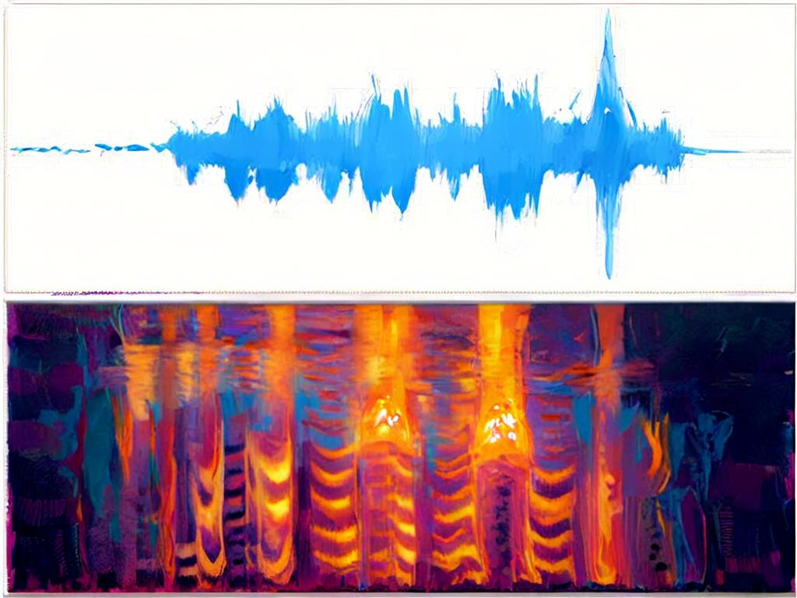

# AcousticFeatures

This library provides common **Acoustic** features for machine learning or sequence analysis tasks. Assume that the signal could be considered a stationary stochastic process.

## Installation

In REPL's package mode:

```julia
pkg> add AcousticFeatures
```

or alternatively from the latest repository:

```julia
pkg> add https://github.com/sonosole/AcousticFeatures.jl.git
```

## Usage

Supported features:

* [ ] MFCC (Mel Frequency Cepstral Coefficients)
* [X] Offline Filterbank Energies
* [X] Online Filterbank Energies
* [X] Log Filterbank Energies
* [ ] LPC
* [ ] LPCC
* [X] Power Spectrum

### Offline Filterbank Energies & Log Filterbank Energies

```julia
using Plots
using WAV:wavread

plts = []
wavdata, Fs = wavread("MonoFile.wav");
data = Float32.(wavdata)

fbank = MelSpec(fs  = floor(Int,Fs),
                eps = 1e-5 ,
                alpha  = 0.97,
                winlen = 512,
                stride = 128,
                nbanks = 128,
                winfunc = hanning)

# for Filterbank Energies
feat1 = fbank(copy(data), nothing)

# for Log Filterbank Energies (default)
feat2 = fbank(copy(data), log)

# for other Filterbank Energies
feat3 = fbank(copy(data), x->x^0.5)

push!(plts, plot(data, xlims=(1,length(data))))
push!(plts, heatmap(feat1, legend=nothing))
push!(plts, heatmap(feat2, legend=nothing))
push!(plts, heatmap(feat3, legend=nothing))
plot(plts...,layout=(4,1),legend=nothing, framestyle=:box, ticks=nothing)
```

### Online Log Filterbank Energies

```julia
using Plots
using PortAudio

ichs = 1    # number of input channels
ochs = 0    # number of output channels
len  = 512  # length of one frame data

mic  = PortAudioStream(ichs, ochs; eltype=Float32, latency=0.2, samplerate=16000.0)
spec = OnlineMelSpec(fs=16000, winlen=len, nffts=1024, nbanks=128)
while true
    frame = read(mic, len)
    feat  = spec(frame.data)
    # use feat to do your job here #
end
```

### Power Spectrum

FFT operation applied on signal's autocorrelation is the standard power spectrum. But speech-like signal is often considered as short stationary stochastic process, thus we here estimate the power spectrum by squaring the magnitude after FFT operation. To reduce spectrum leakage, window function is used. The constructor is straightforward as:

```julia
PowerSpec(;
          fs       :: Int = 16000,          # sampling frequency
          fmin     :: Real = 0,             # min frequency
          fmax     :: Real = fs/2,          # max frequency
          winlen   :: Int = 256,            # window length
          dilation :: Int = 1,              # down-sample ratio
          stride   :: Int = winlen/2,       # distance between two adjacent frames
          nffts    :: Int = winlen,         # the bins of FFT transform
          donorm   :: Bool = false,         # whether normalize the spectrum
          winfunc  :: Function = hanning,   # the windowing function
          type     :: DataType = Vector{Float32})
```

well let's see how to used it

```julia
using ChirpSignal
using Plots, Test
using AcousticFeatures

# create chirp signals
fl = 1000.0  # start frequency
fh = 6000.0  # final frequency
Fs = 16000   # sampling frequency
T  = 5.0     # duration of signal
data1 = chirp(T, Fs, fl, fh, method="linear");
data2 = chirp(T, Fs, fl, fh, method="logarithmic");
datas = [data1 data2];   # 2-channel input

# single channel powspec
singlepow = PowerSpec(
            fs = Fs,
            fmin = 0,
            fmax = 8000,
            winlen = 256,
            dilation = 1,
            stride = 128,
            nffts = 256,
            winfunc = bohman,
            type = Vector{Float64}) # Vector represents single channel input

# multi-channel powspec
multipows = PowerSpec(
            fs = Fs,
            fmin = 0,
            fmax = 8000,
            winlen = 256,
            dilation = 1,
            stride = 128,
            nffts = 256,
            winfunc = bohman,
            type = Matrix{Float64}) # Matrix represents mutiple channels input

# get power spectrums
y1 = singlepow(data1);
y2 = singlepow(data2);
ys = multipows(datas);

@test all(ys[1,:,:] .== y1)
@test all(ys[2,:,:] .== y2)

plot(heatmap(ys[1,:,:]), heatmap(ys[2,:,:]), layout=(2,1))
```
In EEG signal processing, we may use multi-channel data format, but most of the time we still use single-channel data.