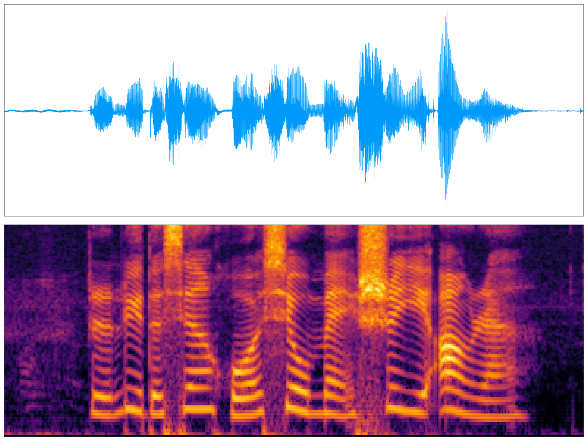

# AcousticFeatures

This library provides common **Acoustic** features for machine learning or sequence analysis tasks.

## Installation

In REPL's package mode:

```julia
pkg> add AcousticFeatures
```

or alternatively from the latest repository:

```julia
pkg> add https://github.com/sonosole/AcousticFeatures.jl.git
```

## Usage

Supported features:

* [ ] Mel Frequency Cepstral Coefficients
* [X] Filterbank Energies
* [X] Log Filterbank Energies
* [ ] LPC & LPCC

### Filterbank Energies & Log Filterbank Energies

```julia
using Plots
using WAV:wavread

plts = []
data, Fs = wavread("MonoFile.wav");
data .= data .- sum(data)/length(data)

fbank = MelFilters(
      fs = floor(Int,Fs),
   alpha = 0.97,
  winlen = 512,
  stride = 128,
  nbanks = 128,
     eps = 1e-5,
 winfunc = hanning)

# for Filterbank Energies
feat1 = fbank(copy(data), nothing)

# for Log Filterbank Energies (default)
feat2 = fbank(copy(data), log)

# for other Filterbank Energies
feat3 = fbank(copy(data), x->x^0.5)

push!(plts, plot(data, xlims=(1,length(data))))
push!(plts, heatmap(feat1, legend=nothing))
push!(plts, heatmap(feat2, legend=nothing))
push!(plts, heatmap(feat3, legend=nothing))
plot(plts...,layout=(4,1),legend=nothing, framestyle=:box, ticks=nothing)
```
